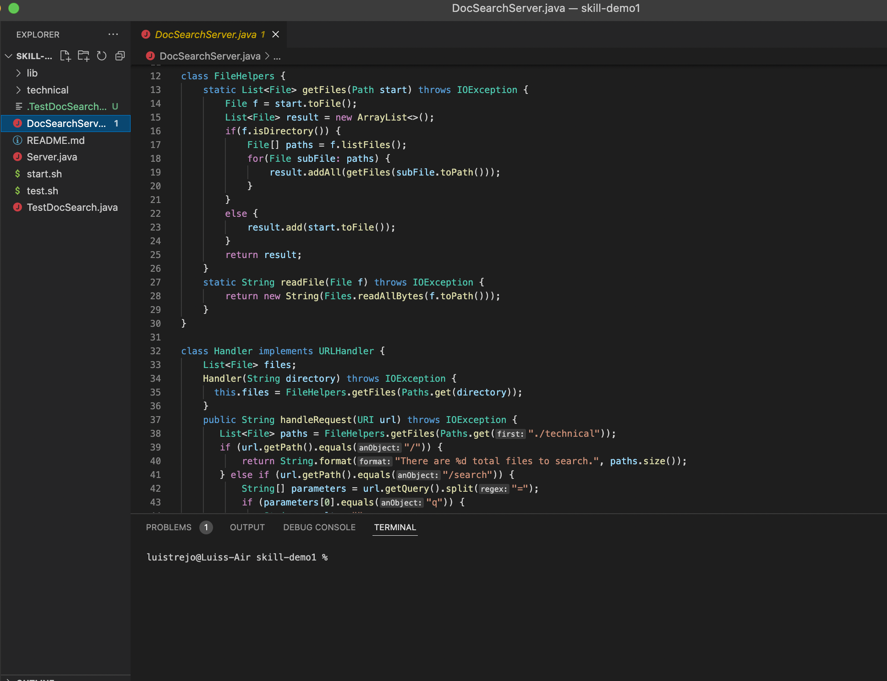
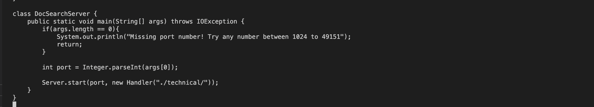

# Lab Report #4 (Week 7)

## Part 1: Week 6 Descriptions 

> Task for this part is to use Vim to create changes into a file that was given called `DocSearchServer.java` there were three options to do.

- My group decided to do this specific task, which was "Change the name of the `start` parameter and it uses to `base`".

### **1. Step 1: Get to the DocSearchServer.java and have this screen up;**

> To be a ble to get this screen you have git clone this; to do that, you would have to do this;

- ` git clone https://github.com/ucsd-cse15l-f22/skill-demo1 week6-skill-demo1` 

- this will get you access to the DocSearchServer.java and will get you set up for this assignment. 

### **2. Step 2: Start by setting up your Vim for this assignment**

- To get started you have to have your `terminal` open and then open it up.

- To use Vim you would start off with: ` Vim filename ` so in this case it would be `Vim DocSearchServer.java `

- You should have something like this;

- Press enter key and you should see something like this in your terminal.

### **3. Step 3: Search for Start by using /Start in Vim.**

- So once you get to this step, you type in /start and you should see something like this. (In the bottom left corner)

- Then you should press the `Enter` key and you should see this.

- If you did this correct, you should see that the `start` in the code in the Vim terminal is being highlighted

### **4. Step 4: Use `c` + `e` + `base` in the Vim.**

- If you manage to get it correct then, you use `c` key and then you use `e` .(When using c it looks like it isn't doing anything however `c` selects the word and `e` is deleted that word.)

- Then you would use type in `base` so that your `start` turns into base.

- Your code should look like this. 

### **5. Step 5: Using `n` and `.` and save your changes from Vim.**

- Once you get this code, use escape key to get out of this insert mode.

- Then you would use `n` so then it would go to the next word that contains `start`

- Then you would use `.` so it would copy and use what you did in Step 4.

> If you pay attention you can see that there is another word that is being replaced into base.

- Do this one more time and it should be like this.

> Please when doing this make sure to not use `n` + `.` for the third time, because there is another start but that is bulit-in for the server to start.
So only use it twice only for this situation.

- The code that you want to make sure to look over.

- After this you should save your work, and to do that you use `:wq` `which :w`  would save your work would be saved and `q` would quit Vim

- Once you have done this, you would be done.

### Total number of keys pressed: 

> Outline;
Vim DocSearchServer.java 
/start <enter> --> 7 keys
‘c’ --> 1 key
‘e’ --> 1 key
base --> 1 key
<escape> --> 1 key
‘n’
‘.’
‘n’
‘.’ --> 4 keys 
:wq <enter>  --> 4 keys 
bash start.sh <value><enter> `(This is to check if what you did in Vim is correct)`

Total amount of keys used is: `19 keys.`

# Part 2: Comparing two ways 

> The goal here is to test out two methods for this assignment, first is to make the changes in VS code and `scp` and run it to see if you did it correctly. Second, way is to login in  `ssh` and use `Vim`  and both run them with `bash test.sh`
of course they would be both timed to see what is better.

***

### Using VSCode and `Scp` 

Time used: `2 minutes and 34 seconds`

- What I did first was change all the `starts` into bases and that was pretty easy.

-Then I did all of this in the terminal;

- The main points of difficulty that I had, was that when I went I tried to use `bash test.sh` and it didn't work instead it gave me and error so instead I used `bash grade.sh` and it worked there.

- Second difficulty, was that I had to remember to change directory and that took me a while to realize as well. 

- Last difficulty, which I forgot after the timer was that I forgot that I wasn't in the correct directory. I had to be in the one that I created via `scp` 

- Those three were the main reasons on why I struggled to get it done quickly and did get it immediately.

***

### Using `Vim` and `SSH`

Time used: ` 2 minutes 15 seconds`

- I started off with `ssh` and  then using commands and vim remotely and then I ended up just using the terminal.

- In this the main difficulties that I had was that `test.sh` wasn't working again so I used `grade.sh` again.

- The second and last one was that, I was really just trying to remember how to do `Vim` quickly and that took some time to do.

## Overall 

> For me it depends, if it is code that someone gave me, then I would always go for the `Vim and SSH` method. However, if it is code that I created myself then I would do the first method and use `scp` because I believe that it would take less time if I do this method. But if I were to choose to only have one, I woud choose `Vim` because I feel like if you use it more frequently, you would most likely be able to be much quicker and time efficient then the other ones.

